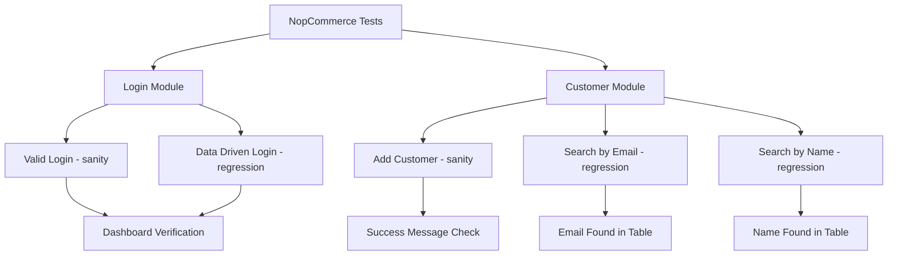

# NopCommerce Cucumber Automation

Selenium + Cucumber BDD framework for NopCommerce admin testing.

## ✨ Features
- Login/Logout automation
- Customer management (Add/Search)
- Cross-browser support
- Data-driven testing

## 🏗️ Structure
```
src/test/
├── java/testRunner/         # Test runner
├── java/stepDefinitions/    # Step definitions  
├── resources/Features/      # Feature files
└── pageObjects/            # Page objects
```

## 🚀 Quick Start
```bash
git clone <repo-url>
mvn test
```

## 🎯 Run Tests
```bash
mvn test -Dcucumber.filter.tags="@sanity"      # Sanity tests
mvn test -Dcucumber.filter.tags="@regression"  # Regression tests
```

## 🔧 Tech Stack
Java | Selenium | Cucumber | Maven | JUnit

## 📊 Test Scenarios


**Reports**: `target/cucumber-reports.html`
